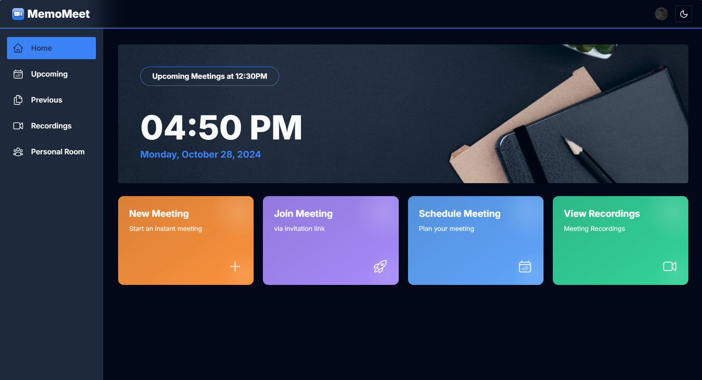

# MemoMeet



MemoMeet is an AI-powered video conferencing platform that provides transcription and meeting summarization. Built with Next.js and Stream's Video SDK, it offers a seamless meeting experience with intelligent insights.

## Features

-   Real-time video conferencing
-   Meeting recording transcription
-   Meeting summarization
-   Screen sharing
-   Meeting recording

## Tech Stack

-   **Frontend**: Next.js 14, TailwindCSS, shadcn/ui
-   **Backend**: Flask API for AI processing
-   **Database**: MongoDB with Mongoose
-   **Video**: Stream Video SDK
-   **AI Models**: Hugging Face (Whisper, Summarization)
-   **Additional Tools**: FFmpeg, Sonner, Axios

## Prerequisites

-   Node.js 18+
-   Python 3.8+
-   FFmpeg
-   MongoDB
-   Stream account
-   Hugging Face account

## Getting Started

1. Clone the repository:

```bash
git clone https://github.com/SatyamVyas04/MemoMeet.git
cd MemoMeet
```

2. Install dependencies:

```bash
npm install
cd server && pip install -r requirements.txt
```

3. Set up environment variables:

```bash
NEXT_PUBLIC_CLERK_PUBLISHABLE_KEY=
CLERK_SECRET_KEY=
NEXT_PUBLIC_CLERK_SIGN_IN_URL=/sign-in
NEXT_PUBLIC_CLERK_SIGN_UP_URL=/sign-up
NEXT_PUBLIC_CLERK_SIGN_IN_FORCE_REDIRECT_URL=/home
NEXT_PUBLIC_CLERK_SIGN_UP_FORCE_REDIRECT_URL=/home

NEXT_PUBLIC_STREAM_API_KEY=
STREAM_SECRET_KEY=

NEXT_PUBLIC_BASE_URL=

MONGODB_URI=
FLASK_SERVER_URL=
```

4. Run the development servers:

```bash
# Frontend
npm run dev

# Backend (in a separate terminal)
cd server
python app.py
```

5. Open [http://localhost:3000](http://localhost:3000) in your browser.

## License

[MIT](LICENSE)

---

Made with ❤️ by [Satyam Vyas](SatyamVyas04) | Inspired by [JSM Tutorial](https://www.youtube.com/watch?v=R8CIO1DZ2b8)
